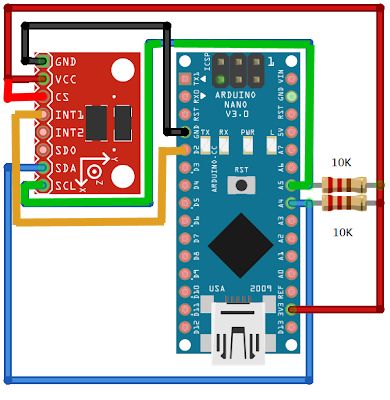

# Rollator-Sensors #

Sonic sensors for a Rollator (Walker)

## ADXL345 Accelerometer ##

The following table identifies the connections for the
ADXL345 to an Arduino Nano

| ADXL345 | Arduino        | Notes                |
| ------- | -------------- | -------------------- |
| GND     | GND            |                      |
| VCC     | 3.3V           |                      |
| CS      | 3.3V           |                      |
| INT1    | D2 (INT0)      | use Interrupts       |
| INT2    | -              |                      |
| SD0     | -              |                      |
| SDA     | A4 (SDA) blue  | 10k resistor to 3.3V |
| SCL     | A5 (SCL) green | 10k resistor to 3.3v |

  
Arduino Nano

## HC-SR04 Ultrasonic Sensor ##

There are four HC-SR04 sensors.  Two facing forward,
one facing left, one facing right.

| HC-SR04 | Arduino | Notes          |
| ------- | ------- | -------------- |
| Vcc     | 5v      |                |
| Trigger | D7-D10  | Echo connected |
| Echo    | Trigger |                |
| GND     | GND     |                |

## Power ##

|   mA | Notes                      |
| ---: | -------------------------- |
| 19.2 | Batteries to Buck          |
|  3.6 | Buck to Main               |
| 15.6 | Buck load                  |
|      |                            |
| 87.0 | Battery to Pololu (Active) |
|  2.5 | Battery to Pololu (Sleep)  |
|  3.6 | Pololu to Main ?????       |

Question: Why is the "Pololu to Main" more than the "Battery to Pololu"?

## Timed Test ##

| mA   | Date/Time    |
| ---- | ------------ |
| 8.39 | 7/28 9:40am  |
| 8.34 | 7/28 1:50pm  |
| 8.32 | 7/28 9:55pm  |
|      |              |
| 8.31 | 7/29 7:49am  |
| 8.30 | 7/29 4:31pm  |
|      |              |
| 8.28 | 7/30 9:47am  |
| 8.27 | 7/30 11:07am |
| 8.26 | 7/30 1:40pm  |
| 8.25 | 7/30 10:08pm |
|      |              |
| 8.23 | 7/31 10:55   |

## Battery Voltage Ranges ##

| Type      | Nominal | Max  | Min |
| --------- | ------- | ---- | --- |
| 2S LiPo   | 7.4     | 8.40 | 6.8 |
| 2S Li-Ion | 7.4     | 8.40 | 5.4 |
