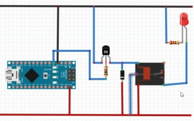

# Rollator-Sensors #

Sonic sensors for a Rollator (Walker)

  
Medline Empower Rollator Walker

|                   |         |
| ----------------- | ------- |
| Overall Width     | 26.5 in |
| Cross Bar Width   | ~18 in  |
| ~ Cross Bar Angle | 60 deg  |

## Requirements ##

* Warn user when nearing obstacles.
  * User adjustable distance range.
  * Vibrate handles
  * three different vibration patterns:
    * front, side, both
* Battery powered without the need for switches
  * Battery must last for at least one week but preferred two weeks

## Parts List ##

| ID             | Name                    | Qty | Notes                |
| -------------- | ----------------------- | --- | -------------------- |
| Nano           | Arduino nano            | 1   |                      |
| ADXL345        | Accelerometer           | 1   | Connected using I2C  |
| 10K            | Resistor                | 2   | connecting to I2C    |
| 1K             | Resistor                | 1   |                      |
| 2N2222         | Transistor              | 3   |                      |
| SRD-05VDC-SL-C | Relay                   | 1   |                      |
| 1N4007         | Diode                   | 1   | Relay                |
| HC-SR04        | Ultrasonic sensor       | 4   | Trigger tied to Echo |
| S9V11MACMA     | Pololu 2.5-9V Regulator | 1   | 5V-Out               |

## Voltage Regulator ##

Pololu 2.5-9V Fine-Adjust Step-Up/Step-Down Voltage Regulator w/ Adjustable Low-Voltage Cutoff S9V11MACMA

[Spec. Sheet](https://www.pololu.com/product/2868)

| pin  | description                                             |
| ---- | ------------------------------------------------------- |
| VOUT | Output voltage; determined by the trimmer potentiometer |
| GND  | Ground                                                  |
| VIN  | Input voltage; should be between 3V-16V                 |
| EN   | Enable; used for setting cutoff voltage                 |
| PG   | Power Good                                              |

### Setting the output voltage ###

The output voltage of the regulator is controlled with a 12-turn precision potentiometer. Turning the potentiometer clockwise increases the output voltage, and it can be measured using a multimeter.

### Setting the cutoff voltage ###

The low VIN cutoff voltage of the regulator is controlled by adjusting the voltage at the EN pin with a 12-turn precision potentiometer. When the voltage on the EN pin falls below 0.7 V the regulator is put in a low-power sleep state and when the voltage on EN rises back above 0.8 V the regulator is turned back on. Turning the potentiometer clockwise increases the low-voltage cutoff. The cutoff voltage can be set by measuring the voltage on the VIN and EN pins and using the potentiometer to adjust the voltage on EN according to the following equation:

EN / 0.7V = VIN / VIN cutoff

EN = VIN * 0.7V / VIN cutoff

For example, if you connect VIN to a battery that currently measures 3.7 V and you want to set the cutoff voltage to 3.0 V, the equation becomes:

EN / 0.7V = 3.7V / 3.0V

Solving for EN yields approximately 0.86 V, so you should turn the potentiometer until you measure that voltage on the EN pin.

Note that the regulator’s low VIN cutoff behavior includes hysteresis: the regulator turns off when EN falls below 0.7 V, but it does not turn back on until EN rises above 0.8 V. Therefore, VIN must reach about 114% of the cutoff voltage before the regulator will re-enable its output (about 3.43 V in this example).

### So for our purposes ###

LiPo VIN cutoff should be 7.0V and the fully charged battery pack should be 8.4V.

EN = 8.4V * 0.7V / 7.0V  
EN = 0.87

Li-Ion VIN cutoff should be 5.6V and the fully charged battery pack should be 8.4V.

EN = 8.4V * 0.7V / 5.6V  
EN = 1.05

## ADXL345 Accelerometer ##

The following table identifies the connections for the
ADXL345 to an Arduino Nano

| ADXL345 | Arduino          | Notes               |
| ------- | ---------------- | ------------------- |
| GND     | GND              |                     |
| VCC     | 3.3V             |                     |
| CS      | 3.3V             |                     |
| INT1    | D2 (INT0) Yellow | use Interrupts      |
| INT2    | -                |                     |
| SD0     | -                |                     |
| SDA     | A4 (SDA) blue    | 10k resistor to VCC |
| SCL     | A5 (SCL) green   | 10k resistor to VCC |

  
Arduino Nano

## HC-SR04 Ultrasonic Sensor ##

There are four HC-SR04 sensors.  Two facing forward,
one facing left, one facing right.

| HC-SR04 | Arduino    | Notes          |
| ------- | ---------- | -------------- |
| Vcc     | 5v         |                |
| Trigger | D5,7,10,12 | Echo connected |
| Echo    | Trigger    |                |
| GND     | GND        |                |

Using the `YogiSonic` library allows us to connect the `trigger` and `echo` pins so we save 
pins on the Arduino.

## Relay ##

The relay is used to powerdown most of the sensors and other devices while the micro-controller is sleeping.

1k resistor between NPN transistor `base` pin and signal pin on the micro-controller.

1N4007 diode to protect the micro-controller from voltage spikes.

## Power ##

|    mA | Notes                      |
| ----: | -------------------------- |
| 120.2 | Batteries to Buck (Active) |
|  19.2 | Batteries to Buck (Sleep)  |
|   3.6 | Buck to Main               |
|  15.6 | Buck load                  |
|       |                            |
|  87.0 | Battery to Pololu (Active) |
|   2.5 | Battery to Pololu (Sleep)  |
|   3.6 | Pololu to Main ?????       |

Question: Why is the "Pololu to Main" more than the "Battery to Pololu"?

## Timed Test ##

| mA   | Date/Time    | Day |
| ---- | ------------ | --- |
| 8.39 | 7/28 9:40am  | 1   |
| 8.32 | 7/28 9:55pm  |     |
|      |              |     |
| 8.31 | 7/29 7:49am  | 2   |
| 8.30 | 7/29 4:31pm  |     |
|      |              |     |
| 8.28 | 7/30 9:47am  | 3   |
| 8.25 | 7/30 10:08pm |     |
|      |              |     |
| 8.23 | 7/31 10:55am | 4   |
| 8.21 | 7/31 10:10pm |     |
|      |              |     |
| 8.20 | 8/1 9:15am   | 5   |
| 8.19 | 8/1 10:00pm  |     |
|      |              |     |
| 8.18 | 8/2 7:00am   | 6   |
| 8.17 | 8/2 8:42pm   |     |
|      |              |     |
| 8.15 | 8/3 8:08am   | 7   |
| 8.14 | 8/3 11:00pm  |     |
|      |              |     |
| 8.12 | 8/4 7:14am   | 8   |
| 8.09 | 8/4 11:23pm  |     |
|      |              |     |
| 8.07 | 8/5 9:58am   | 9   |
| 8.05 | 8/5 2:03pm   |     |

## Battery Voltage Ranges ##

| Type      | Nominal | Max  | Min |
| --------- | ------- | ---- | --- |
| 2S LiPo   | 7.4     | 8.40 | 7.0 |
| 2S Li-Ion | 7.4     | 8.40 | 5.6 |
